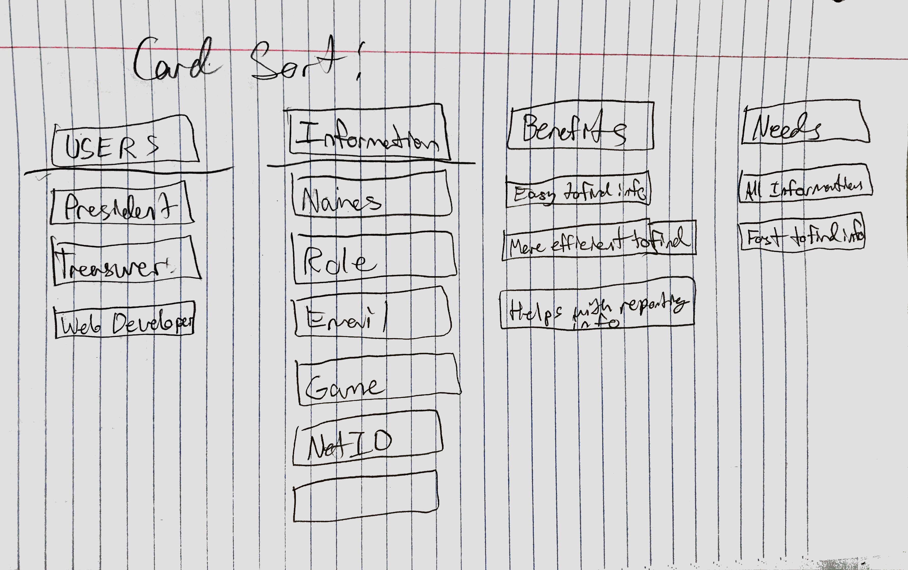
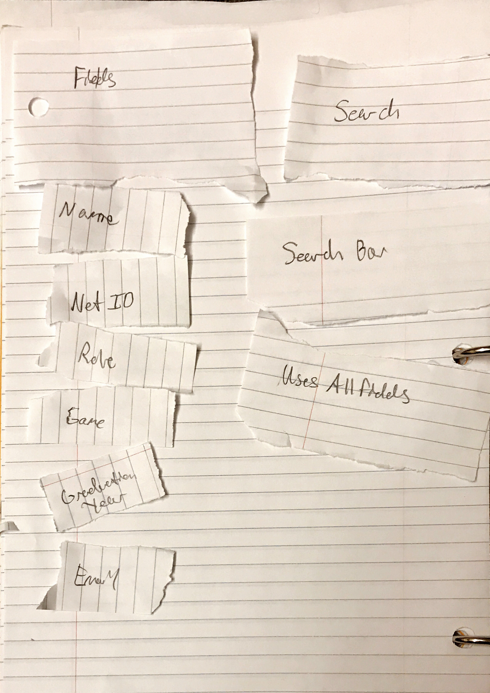
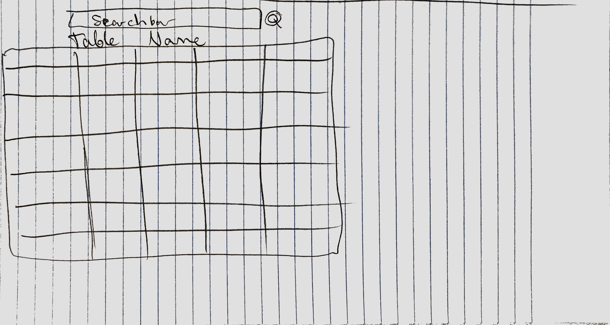
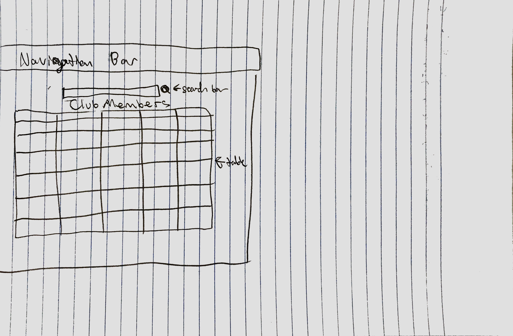
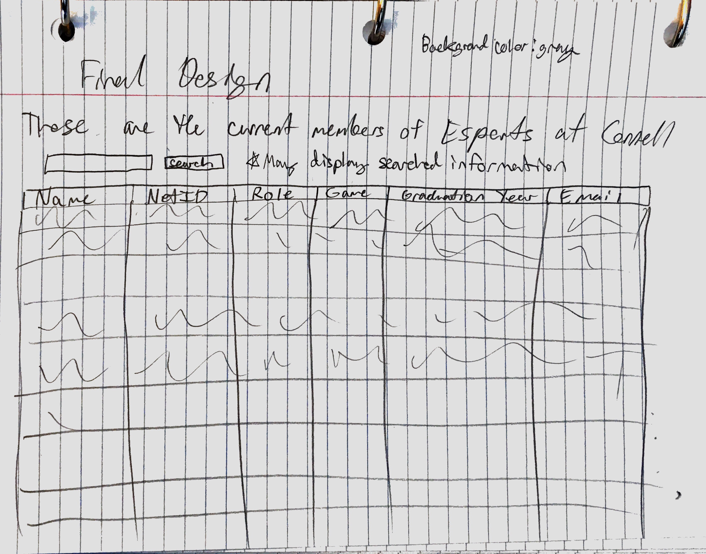
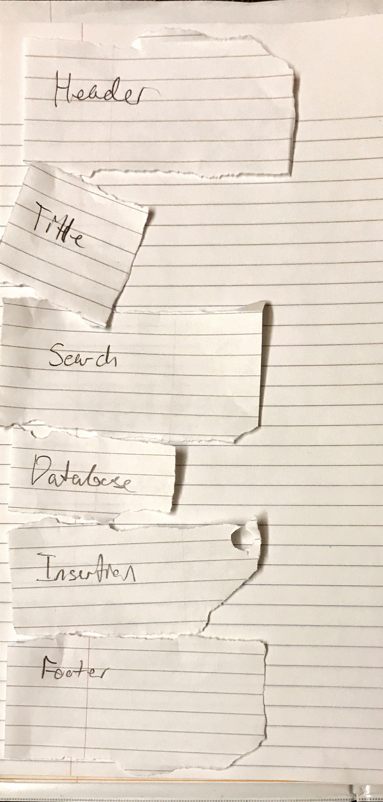
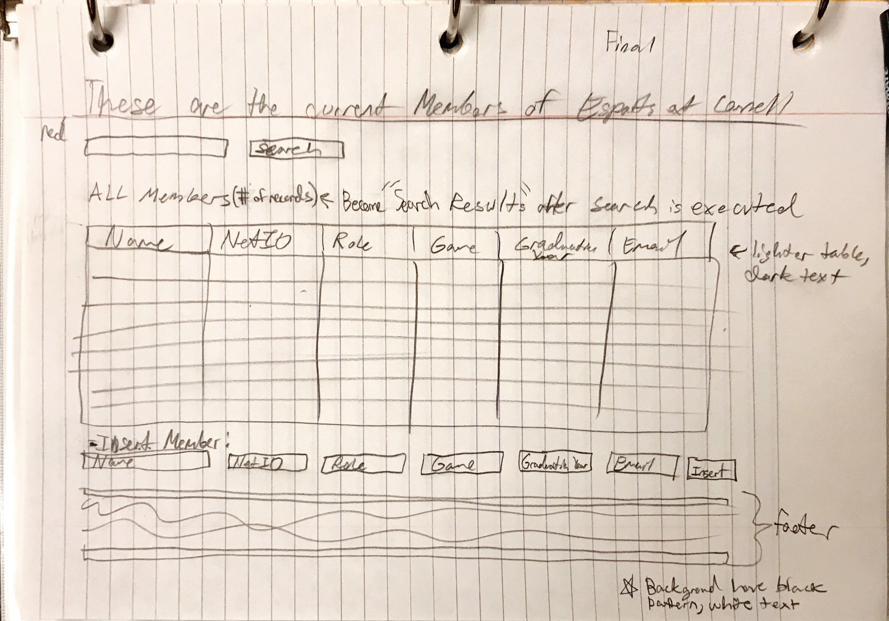

# Project 2: Design Journey

Your Name: Rose Zhou
**All images must be visible in Markdown Preview. No credit will be provided for images in your repository that are not properly linked in Markdown. Assume all file paths are case sensitive!**

# Project 2, Milestone 1 - Design, Plan, & Draft Website

## Describe your Catalog
My collection will be one that documents the club members in my club, Esports at Cornell. Each member is a record. It will keep track of netIDs, roles, game that they play, graduation year, email, id, and name in each record. The serach results of it will display the full record of all members that fit the search. Otherwise, it will display records of literally all members. At any time, the number of records in the table will be counted and displayed on the site above the table. Name and netID can't be NULL because without those two, a record is useless (because you need a netid to prove the member is a member and to verify they are actually real, then the name is necessary because without it, we will not know who this person is). Net ids should be unqiue, names don't need to be. All fields are text type except graduation year will be an integer, and this will be the most convenient way of typing data.

## Target Audiences
The target audience will be for the admins/officers of my club, who will need this information in their email list serve and treasury decisions, such as looking the number of members that play a certain game (after seaching for "Overwatch" etc) planning our budget. Admins are college students of age 18-22, who will need to read information quickly. Other needs include reporting the number of members to encourage sponsorship (more members means more interest from sponsors) and gaining funding from Cornell (also more members increases likelihood of Cornell funding). I chose this target audience because the target audience needs this information for club activities, but while other groups of people will have no use for this information, the data is very important to admins.

My site fulfills the target audience's needs by making the table easy to read, while also counting records for purposes like reporting the number of members to be able to qualify for financial funding from a sponsor.

## Design Process
**
This is my card sort for planning the site.

This is my planning for the database fields and search queries.

This is my first idea for the layout of the site. I decided to center items because it will look more balanced (space-wise) with the white space even on both sides. The picture may make it seem to float left but I really meant that everything in the picture will be centered. I plan to use black, white , and red in the site since they are the club colors. The title, table header, and insert header will be white to be read on a black background. Maybe I can add red lines to make some color. I will have one search search through all fields since it'll be easier and simpler for the user to search quickly compared to picking from a drop down or entering into multiple fields.

This is my second idea for the layout of the site. The table will float left as the data displayed changes. I still decided to keep the search bar and button centered due to ease of convenience to access it, as I believe having it in the center will make it easier to find.

This is my former final sketch. I decided to have the search bar and button float left as our eyes naturally read from left to right, so it would be better to have the search bar, button, and table keep to the left, as well as have the table items align to the left, in order to make it eaiser to read. A benefit needed of this site is also to have the information be read fast by users (admins of my club) so keeping all table items as well to the left will be more beneficial. I also decided to have the background be light gray when actually implemented because it is one of the club colors we are deciding on, and it makes it easier to see the elements of the table compared to a darker color.

This is my overall planning method of the site sorting and moving these items.

## Final Design Plan
This is my final sketch. This is with the insertion and search finalized along with the table. I decided to have the search bar and button float left as our eyes naturally read from left to right, so it would be better to have the search bar, button, and table keep to the left, as well as all other elements keep left, in order to make it easier to read. A benefit needed of this site is also to have the information be read fast by users (admins of my club) so keeping all table items as well to the left will be more beneficial. I also decided to have the body background be light gray/black pattern because it is one of the club colors we are deciding on. Then, the table cells will be a lighter/white transparent color to look aesthetically pleasing while also readable for the table information. Some studies have concluded that reading black text on a light background is easier to remember, so this is another benefit to this decision. I also added a count for records above the table since I realized that when needing to count members, having many members will be hard to count people. All officers will be instructed how to use the database as well so there is no confusion what the count or insert fields mean. I've also decided to use arial for the table information because it is easy to read, and another bold-like font for h1 and h2 to clearly show where the title, table, and insert sections are. I kept one search bar that searches through all fields since it is easier/simpler to use compared to multiple inputs.

The site uses black, white, and red since those are the club branding colors. I used some red to make the footer stand out more and in general make the site more colorful than just black and white, without the red standing out too much. That way, the red makes it clear that it is still Esports at Cornell. Our club site also has some red lines, so it gives a more consistent branding image where recognizing the red line pattern will make the user realize that the site is related to the club.

## Templates

I would make my title section a template as a navigation bar wouldn't be needed if my site will be one page. If in the future more pages are added, I have php logic in the template that can be changed to update for that.

I also included a footer holding source citation information and a warning saying to be careful with the data, since some people are sensitive over other people knowing emails or graduation year (for privacy reasons). Other pages might need the warning and citation for the background image, especially because the background would be used for other pages if other pages are added.

## Database Schema Design

Table: Club Members
* name: Member's full name (distinguishing between first,last, or middle name is not needed), cannot be null, text type
* netID: member's netid (not null, text type, unique)
* role: members role (ex. president, null (unknown), treasurer, web developer), text type
* game: the game that the member plays competitively on a team for the club since we are esports based (ex. overwatch, none, hearthstone), text type
* graduation year: year that member will graduation, integer type
* email: member's email, text type
* id: will be a unique artificial key used as a primary key, integer type, auto increment, unique, cannot be null

## Database Query Plan

1. All records

SELECT * FROM club_members;

2. Search records

SELECT * FROM club_members WHERE name LIKE '%'||:search||'%' OR graduation_year LIKE '%'||:search||'%' OR netid LIKE '%'||:search||'%' OR role LIKE '%'||:search||'%' OR game LIKE '%'||:search||'%' OR email LIKE '%'||:search||'%';

3. Insert record

INSERT INTO club_members (name, netid, role, game, graduation_year, email) VALUES (:name, :netid, :role, :game, :graduation_year, :email);

## Code Planning

will need :
* title/navigation bar code for plan
* table code such as <td> etc to place sql code
* a search bar input
* a button to submit the search
* get requests
* form tags
* function for grabbing database data with declaration etc and assigning returned data as an array to a variable, returns nothing
* function to take input of a record and echo it as a <td> info </td> and then only display wanted information
* other helper functions that help turn null data into a table element like "unkown email"
* the form to insert information
* the sql queries for search and insert
* footer to citation and put warning

# Final Submission: Complete & Polished Website

## Reflection

I've improved on documenting and planning the design process. I've also learned how to format text in a more aesthestic way and learned how to use css to align things to the left. Then, I've found better color schemes and ways to display a table without using solid borders. Now, I've also leanred how to use sql, which was something I always wanted to know. However, learning sql meant having trouble with editing a database and planning it out. I had to learn how to modify tables in the db browser as well, which turned out to be much more simple than I expected. At first I was trying to copy tables when Really I just had to select the modify option in the browser.
